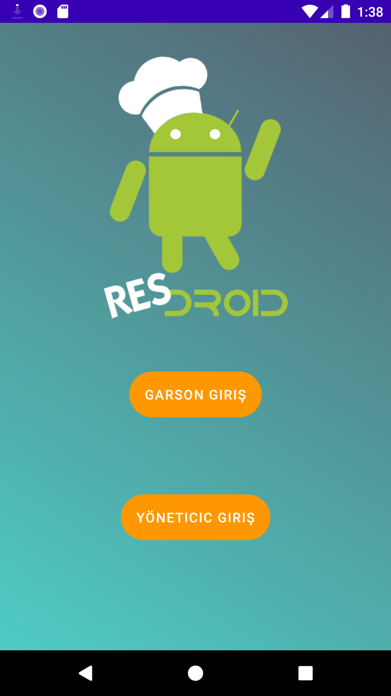
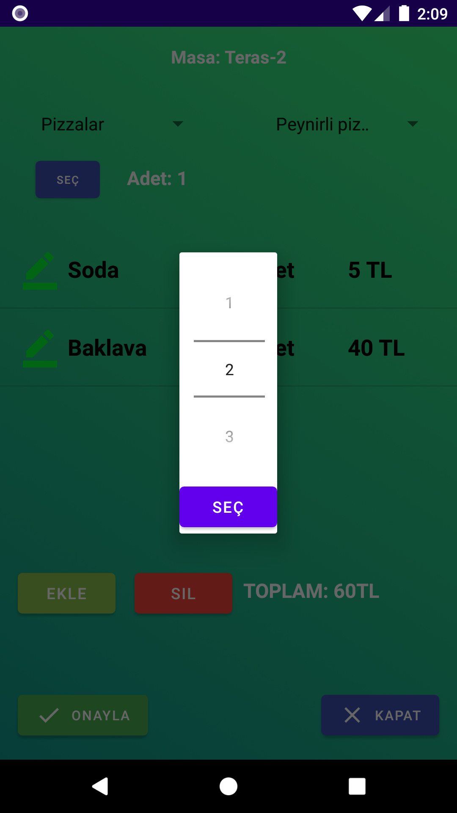
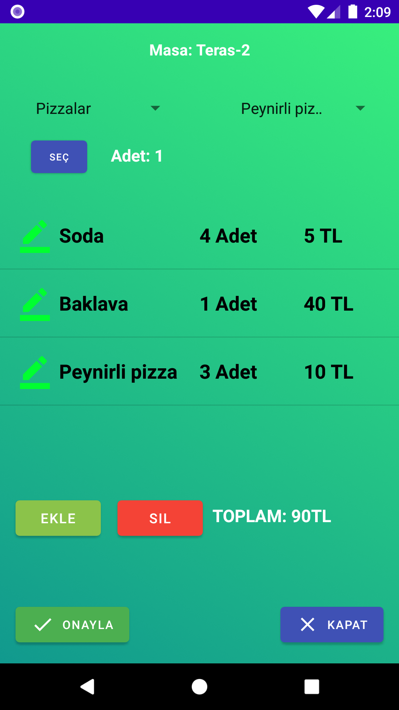
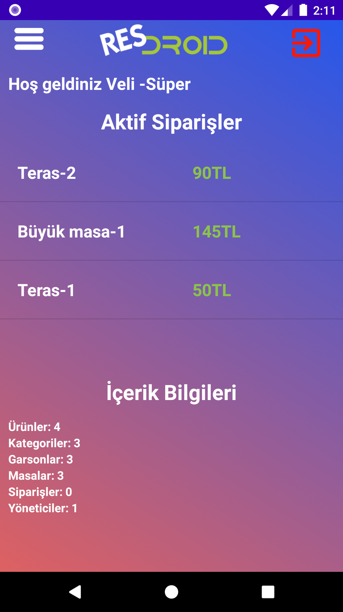
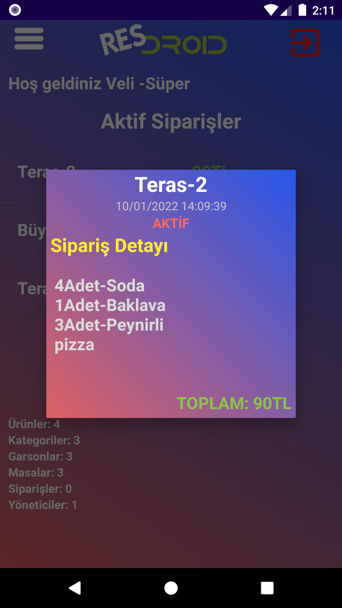
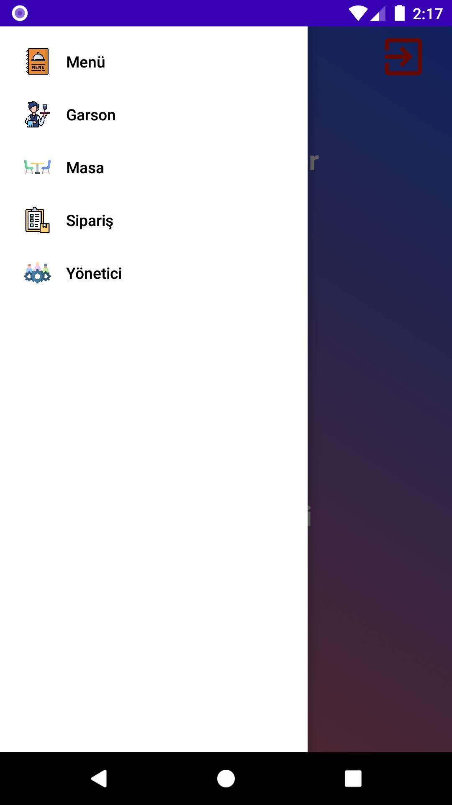
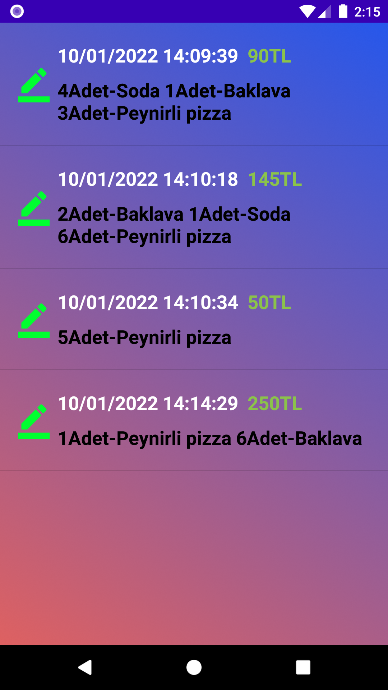

# Resdroid

   

Android bases restaurant order management mobile app.

## Used Tools
- Android Studio
### Database
- Google Firebase

## Features
- Admin and waiter panel.
- Predefined menu in different categories.
- CRUD for waiters, admins, menu items, categorys, tables.
- Active orders and order history viewing.

## Screenshots

### Login screen

   

### Waiter screens

  
  
   
   

### Admin screens

  
  
   

#### Order history

  

#### CRUD Example

  

## License
MIT

